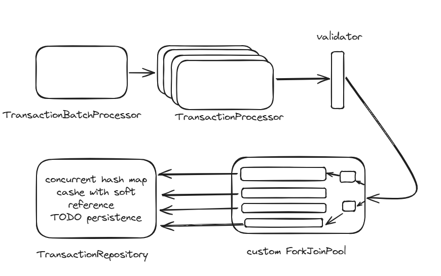
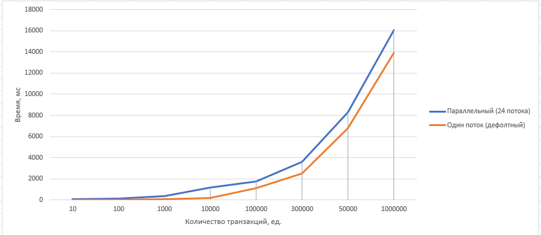

# sbreackets2
Task 4 SB challenge: transaction service on Spring

**Technologies:**
- Java 17
- Gradle
- Spring Boot
- JUnit 5
- Mockito

**Features:**
- [x] Performance Optimization:
    - [x] Inefficient data structures are replaced (array list -> concurrent hash map with soft references) and algorithms are optimized
    - [x] Code duplication is eliminated
    - [x] Memory usage is improved
- [x] Code refactoring:
    - [x] Duplicate elements are put into separate methods or classes
    - [x] The structure of the code is refactored to improve its readability and ease of support
- [x] Memory Management:
    - [x] Memory leaks are found and fixed (cache problems)
    - [x] Design patterns are used
- [x] Exception Handling:
    - [x] Input parameter validation
    - [x] System can continue to work in case of errors
    - [x] Centralized error logging
- [x] Testing:
    - [x] Performance tests
    - [x] Unit tests
    - [x] Mock tests
    - [x] Integration tests

**Parallel transaction processing solution:**



Using transaction DAO as cache - in next steps the persistence will be added (writing to DB through cache). Parallel transaction handling is provided by parallel processing on custom fork join pool and data saving in concurrent hash map that saves crash situations (OOM) with soft reference - we expect big cache and can't loose transaction data. If such situation will happen than the first solution will be logging in finalize method (now it is commented). 

**Parallel and default modes comparing**



I think the results will be greater to parallel mode cause the test was on my week laptop that has small cpu and ram characteristics. May be other collection that is faster at insert need to be used in future:
```
Процессор	11th Gen Intel(R) Core(TM) i5-1135G7 @ 2.40GHz   2.42 GHz
Оперативная память	8,00 ГБ (доступно: 7,78 ГБ)
********************************************************
********************************************************
Тип системы	64-разрядная операционная система, процессор x64
```

**App starting**

Gradle >=7.3 and java >=17 is required for app start

Run the next command from root directory to build and start program:

- Unix:

```
sudo gradlew clean build bootRun
```

- Windows:

```
./gradlew clean build bootRun
```

Run the next command from root directory to run tests:
- Unix:
```
sudo gradlew clean build bootTestRun
```
- Windows:
```
./gradlew clean build bootTestRun
```

**App using and documentation**
* An app will be started on `8080 port`
